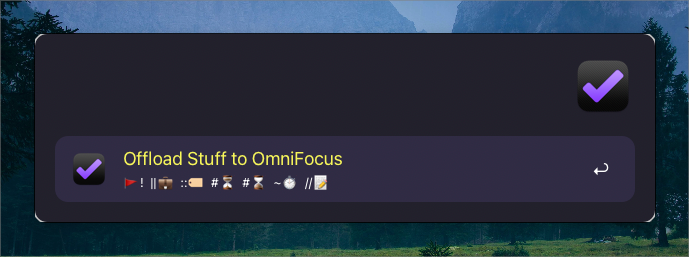
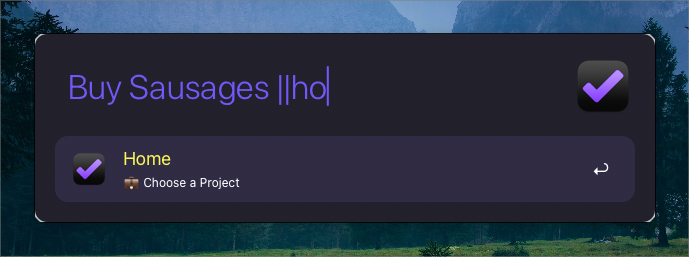
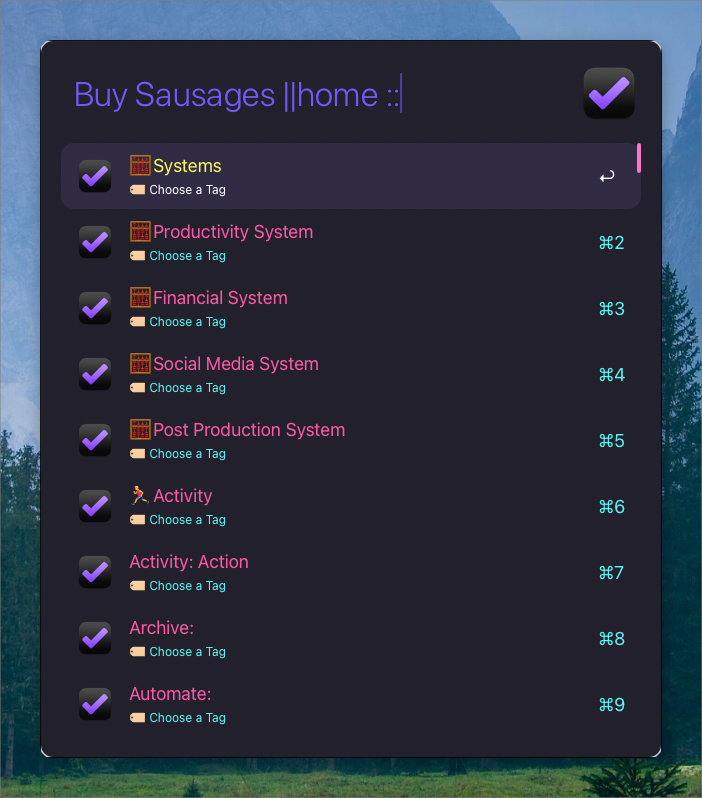
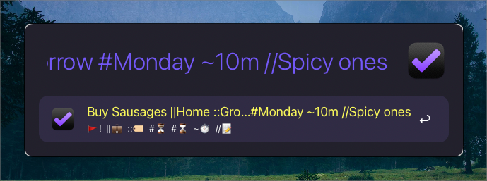

## # Task Quick Capture for OmniFocus Workflow

> A task creation workflow for Alfred, with live project and tag filters, autocompletion, and modifier options to copy a task link to the clipboard or reveal it in OmniFocus.

### Screenshots

### Supported Actions

- Add a task 
- Add a task with assigned project 
- Add a task with assigned tag 
- Add a task with defer date 
- Add a task with due date
- Add a task with estimated duration 
- Add a task with note 
- Add a task and copy its link to clipboard without opening OmniFocus
- Add a task and reveal it in OmniFocus
- Live filter search as you assign the project 
- Live filter search as you assign the tag

### Quick Usage Overview

|     | Feature        | Trigger        |
|-----|----------------|----------------|
|     | Add Task       | Type task name |
| 🚩   | Flag Task      | Task!          |
| 💼   | Assign Project | \|\|Project    |
| 🏷️   | Assign Tag     | ::Tag          |
| ⏳   | Defer Date     | #Date          |
| ⌛️   | Due Date       | #Date          |
| ⏱️   | Duration       | ~120m          |
| 📝   | Add Note       | //Note         |
|     | Copy Task Link | ⇧↩             |
|     | Reveal in OF   | ⌥↩             |

### Usage

Run the workflow either by typing the default keyword: "todo" or assign a hotkey. (I personally use ⌃⌥⇧⌘T)
Once the workflow is up, you will have a subtitle telling you what to do - 🚩!  ||💼  ::🏷️  #⏳  #⌛️  ~⏱️  //📝. 
 
   `All of the following can be combined in any order:` 

- To simply add a task to Inbox, just type the task and press enter.
- To mark the task as flagged follow the task name with an exclamation mark. - Task!
- To assign a project to the task, type || followed by the project name. - ||Project
  * As soon as you type || a list of all your projects will appear and filter down as you start typing your project name.  
- To assign a tag to the task, type :: followed by the tag name. - ::Tag
  * As soon as you type :: a list of all your tags will appear and filter down as you start typing your tag name.
- To set a defer date, type # followed by a date or natural language. - #Friday
- To set a due date, type # followed by a date or natural language. - #Tomorrow
  * Note that if there is only one # in a string, it will be interpreted as defer date. 
- To set estimated duration type ~ followed by a number followed by m without space. - ~120m
- To add a note type // followed by desired text. - //Note

  `Modifier Keys:`

- ⇧↩ Copies a direct link to the last created task to the clipboard.
  * This uses AppleScript to locate the most recent task in OmniFocus.
- ⌥↩ Reveals the newly created task directly in OmniFocus.
 ---  
### Credits

This workflow is based on:

• David Verhasselt’s Alfred Workflow — originally built for Alfred 2 and OmniFocus 2. It’s ~10 years old and didn’t run on my setup, but it inspired this reboot.

• OmniFocus Collection workflow by Otto Automator (The Omni Group): Helped me adapt the project/tag filtering mechanism.

---
### Version

- **2025.03.29** – Initial release with autocomplete, date parsing, and task modifiers.
